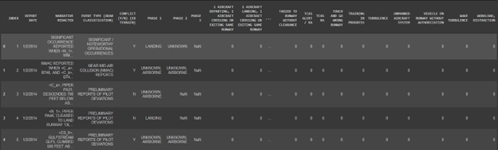
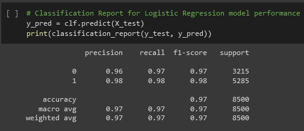
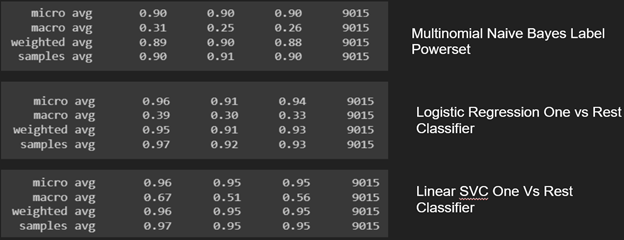
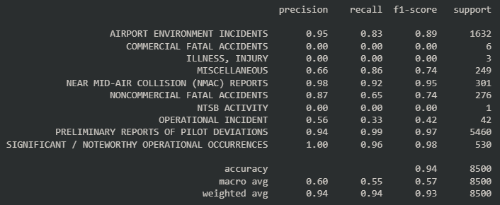
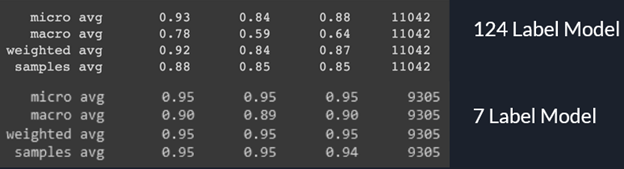
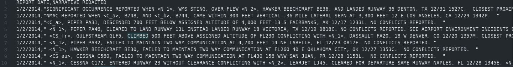
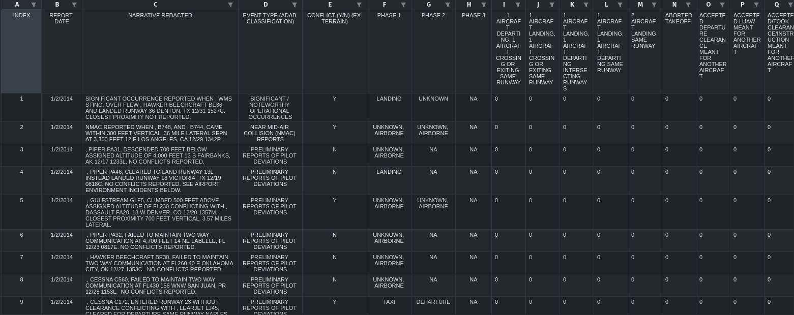

# FAA-text-mining

### Software/Tools
Python, Pandas, Matplotlib, Scikit-learn, Nltk, Google Colabs, Jupyter Notebook

## Brief Description of Problem
The Federal Aviation Administration (FAA) has developed a detailed Aerospace Hazard Classification System (AHCS) taxonomy, which categorizes several thousand different pieces of information including causal and contributing factors, phase of flight, occurrence categories, and event outcomes. This project focuses on developing machine learning models that can extract AHCS elements from redacted event narratives (personal and sensitive information removed) provided by the FAA. In addition, the FAA supplied pre-labeled event narratives that served as a training sample.

## Project Summary and Results

#### General Overview
The following figure, figure 1, is a snippet of the training data provided to us and the various elements we want to extract from each narrative.
  

##### Figure 1: Snapshot of training data

After reviewing the provided data and meeting with our Industry Advisor, Mr. Won advised us to break the overall problem into 3 sub-problems: Conflict Classification, Flight Phase Classification, and AHCS Labeling. For each problem, we noticed that there were a handful of data points that occurred far more often than others which resulted in a skewed distribution of data. In order to account for this class imbalance, we took a stratified sampling approach when splitting the data into training data and testing data.  

#### Conflict Classification
We were tasked with creating a model that can predict whether or not there is a conflict detected in the event narrative. A conflict is categorized as a potentially hazardous situation where two aircraft are involved, so this task can be generalized as a binary classification problem by this logic. We decided to use a logistic regression model to tackle this problem and the inputs provided to the model are TF-IDF vectorized events narratives and the labels were Yes and No. The results of this model are displayed in figure 2 where our model has high values for various classification metrics.


##### Figure 2: Classification report for the conflict prediction model 

#### Flight Phase Classification
For this task, we need to extract the flight phase of each aircraft involved in the event narrative. For example, in this narrative, “<N_1>, CESSNA C172, ENTERED RUNWAY 23 WITHOUT CLEARANCE CONFLICTING WITH <N_2>, LEARJET LJ45, CLEARED FOR DEPARTURE SAME RUNWAY NAPLES, FL 12/28 1345E ” there are two aircraft involved where one was taxing into the runway and the other was departing from the same runway. There are 27 different flight phases that an aircraft can be in given the provided data, so we approached this question as a multi-class classification problem. We created and tested 3 different models in order to solve this problem and the following figure, figure 3, illustrates the performance of each model.

  
##### Figure 3: Three different models used to classify flight phases

#### Event Type Classification
Our next task was event type classification, for which we approached by taking the cleaned narrative data and using a logistic regression model to find the probability of each event occurring. In total, there were 12 event types, with some of the types being more dominant in our data. This wasn’t a multi-label classification problem like the Phase Classification or the ACHS Labeling because the 12 event types are independent from each other and multiple cannot occur within the same flight. The result of the performance is displayed in figure 4, where the model performs really well for the labels that occurred a lot in the data.


##### Figure 4: Classification report for the event type prediction model

#### AHCS Labeling
This task was the most challenging of the three sub-problems. There are 124 different AHCS Labels and they each drastically differ in how often they occur in our data. For example, an AHCS such as “Parallel Runways” occurs a thousand times while an AHCS like “Space Vehicle, Facility” occurs once. This drastic class imbalance in our data makes creating a good model very difficult. As a result, we created a new hierarchical grouping system where we reduced the number of labels to 7 by grouping the old labels under these new general categories. The following figure, figure 5, showcases the difference in performance between a Linear SVC one vs. rest classifier for the 124 AHCS labels and a Linear SVC one vs. rest classifier for the new 7 labels.


##### Figure 5: Model for the 124 Labels (top) vs. model for the new 7 labels (bottom)

## How To Run The Deliverable
In order to run and train the models in the ideal environment with all the necessary dependencies, you need to build a docker container using the Dockerfile provided in the Deliverable folder. First, navigate to the deliverable folder and run the following command to build the docker image: 
```
docker build -t <desired tag name> -f Dockerfile .
```
You can enter your preferred tag name for the docker image. After building the docker image, you can run the container and run the scripts by creating an interactive bash shell with the following command:
```
sudo docker run -it <tag name of desired docker image> bash
```
This will allocate a tty for the container process and open a bash shell. You will now be able to run the inference and train scripts within the container by simply typing:
```
python inference.py
```
or 
```
python train.py
```

## Input Format For The Scripts
### **Inference Script**
In order to run the inference script, you need to input the path of the CSV file that contains the redacted narratives that you want to classify. The CSV file is expected to have 2 columns: Report Date and Redacted Narratives. The following is an example of the expected format of the CSV file. 



After running the inference script and inputting the path of the CSV file, there will be an option to also make predictions using the various alternate AHCS labeling systems that Mr. Greg Won provided us. These different labeling systems can provided very useful information for graphs and general insight on the trends that are present in the data.<br/>
After the classification is complete, the script will produce an Excel file, named "Results.xlsx", that contains the models' predictions for Event Type, Conflict (Y/N), Flight Phases, and AHCS Labels for all the narratives in the CSV file. If the user chooses to also classify using the different AHCS Labeling systems, the scripts will produce an additional Excel file, named "NewLabelResults.xlsx", that contains the models' predictions for 3 different AHCS Labeling systems. These files are located in the results folder.

### **Training Script**
In order to run the train script and retrain the models with new narratives, you need to input the path of the Excel file that contains the training data. The Excel file is expected to have 132 columns: Report Data, Redacted Narratives, Event Type (ADAB Classification), Conflict (Y/N), Phase 1, Phase 2, Phase 3, and 124 columns for 124 different Aerospace Hazard Classification System Taxonomy Labels. The following is an example of the expected format of the Excel file.



After the training is complete, there will be a print out of classification reports for each of the models to demonstrate the performance of each model. The resulting models, TF-IDF vectorizers, and mutli-label binarizers are saved under their respective folders. 